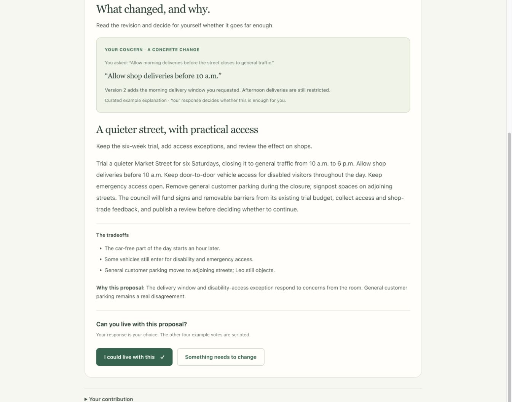

# The Forum

**Different views. A shared way forward.**

Forum helps a group move from opinions to one concrete proposal more people can live with. Participants understand another perspective, accept a proposal or ask for a change, then see how the revision responds. The result records either agreement or honest disagreement—including concerns the majority did not resolve.

No reply threads, popularity contests, or account setup. You respond to a proposal, never to a person.



*The guided example: a concern about shop deliveries becomes a specific clause in the revised proposal. The participant decides whether the change is enough.*

## The loop

```text
Share your view
      ↓
Understand the common ground and disagreements
      ↓
Consider one concrete proposal
      ↓
Accept it — or explain what needs to change
      ↓
Review the revision and see what happened to your concern
      ↓
Agreement, or an honest record of the remaining disagreement
```

Each proposal needs 75% of eligible participants to accept. If it falls short,
the mediator revises it within the round limit. Missing responses never count
as support; insufficient participation is reported separately.

## Try the complete example

Requires Python 3.11+. From the repository directory:

```bash
python3 -m venv demo-venv
./demo-venv/bin/python -m pip install -r demo/requirements.txt
FORUM_BACKEND=mock ./demo-venv/bin/python -m uvicorn server:app --host 127.0.0.1 --port 8710 --app-dir demo
```

Open [Forum locally](http://127.0.0.1:8710) and choose **Try a five-minute example**.

1. Explore a concern about a car-free Saturday trial: deliveries, disability access, or parking.
2. Read common ground and a fair account of another perspective.
3. Consider the first proposal and accept or send the selected example objection.
4. Read the revision, with a quoted clause explaining what changed or remains unresolved.
5. Respond again. Acceptance gives a 4/5 example agreement; objection gives a 3/5 disagreement result.
6. Return Home to find the saved discussion and its result, or try another perspective.

The four other viewpoints, proposals and peer votes are explicitly scripted. Your choices are counted as chosen. **No API key, model call, generated persona, or cost is involved.** This is a demonstration, not a real council decision. The mock backend does not pretend to mediate arbitrary topics.

The `python -m` commands also work if a moved virtual environment has stale executable wrapper paths.

## Discuss a real question with a group

Configure one of the existing live backends using your own environment, then launch the same application. For example, with `OPENAI_API_KEY` already set:

```bash
FORUM_BACKEND=openai-api ./demo-venv/bin/python -m uvicorn server:app --host 127.0.0.1 --port 8710 --app-dir demo
```

Choose **Bring your own question**, set the question/context/timing, and share the room URL on a deployment your group can access. The loopback URL above is only accessible on the host computer; it is for local testing. Deployment is not configured by this repository.

New web discussions contain real participants only. At least three people must share views. Intake stays open until its deadline or the host begins early; reaching the minimum does not immediately lock out friends. Each participant sees the opposing perspective before responding. A round closes when everyone responds or its deadline passes. The current proposal remains readable while waiting.

Agreement requires **75% of everyone eligible for that round**, rounded up. Missing responses never count as support. Insufficient participation receives its own result. Four rounds is the maximum for a live discussion.

## Your words and your identity

- Opinions are visible under a pseudonym inside the discussion.
- Individual acceptance choices and raw objections are not exposed through the public room API. Objection themes may be summarized without attribution by the mediator.
- Personal concern-to-clause explanations are visible to their author.
- Raw prompts and responses are stored locally; the public audit endpoint returns only call metadata.
- My discussions and name settings are private to the current browser identity.
- Identity is saved in an HTTP-only cookie. Keep using that browser; clearing cookies or switching devices does not recover the identity. Name-only login has been removed, and editing a display name preserves the identity.

These are small-group prototype mechanics, not proof of personhood. Live model summaries and mediation quality still need evaluation before an external pilot.

## Development and checks

```bash
./demo-venv/bin/python -m pip install -r demo/requirements-dev.txt
FORUM_BACKEND=mock ./demo-venv/bin/python -m unittest discover -s demo/tests -v
node --check demo/web/static/forum.js
node --check demo/web/static/room.js
```

Tests use temporary SQLite databases and local model fixtures, never production deliberations or paid APIs. They cover example branches, group participation, private response shaping, stale responses, identity, deadlines and restoration.

Storage defaults to `demo/forum.db`; override with `FORUM_DB`. Existing data is not reset on startup. Use **one uvicorn worker**: a background scheduler checks persisted deadlines and resumes unfinished phases, with one worker per active room inside that process. Multi-process coordination is not implemented.

```text
demo/
  server.py             Pages, validated APIs, cookie identity, scheduler lifespan
  forum/
    example.py          Curated five-minute scenario; no model calls
    engine.py           Mapping, proposals, persistent concerns, responses, outcomes
    service.py          Room lifecycle, deadlines, private views, return feed
    db.py               SQLite persistence
    prompts.py          Mediator instructions and evidence schema
    llm.py              Existing model backends
    mockdata.py          Legacy research-run fixtures
    personas.py         Deferred persona research
    fidelity.py         Persona evaluation harness
    cli.py              Research runner
  web/
    home.html           First visit and My discussions
    room.html           Shared participant/observer journey
    profile.html        Private name and session settings
    static/             Shared styling/helpers and room renderer
  tests/                Temporary-database integration checks
```

Backends are selected by `FORUM_BACKEND`: `mock`, `openai-api`, `anthropic-api`, or `claude-cli`. `FORUM_MODEL` overrides the backend's configured model. Without an explicit backend, the existing detection order is Anthropic key, OpenAI key, installed Claude CLI, then mock. A configured backend is not a guarantee that credentials or model access are valid; failures preserve the room and allow the host to retry.

The persona research runner remains available, independently of the web example:

```bash
cd demo
FORUM_BACKEND=mock ../demo-venv/bin/python -m forum.cli
```

The CLI's historical mock fixture is for its default AI-gains topic. Synthetic persona improvements are deferred.

See [PRODUCT.md](PRODUCT.md) for the current product contract, [UX_UPDATE_PLAN.md](UX_UPDATE_PLAN.md) for the assessment and rollout plan, and [STRATEGY.md](STRATEGY.md) for the longer-term research vision.
